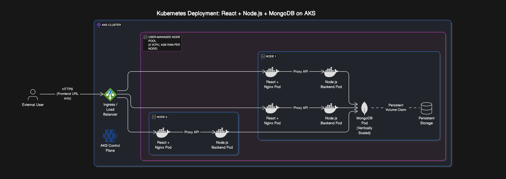

# A fork of https://github.com/mohamedsamara/mern-ecommerce

This project deals with the containerized deployment in Kubernetes Cluster. 

## Additional changes: 

1. Optimized Docker Images
2. Added health check API
3. Auto connect to database when health check fails.
4. Updated frontend nginix configuration to hide backend url.

## Architecture Diagram

The project uses a typical MERN stack (MongoDB, Express/Node.js, React, Nginx) deployed on Kubernetes.

1. Frontend: React app served by Nginx, which also reverse proxies API requests to the backend.
2. Backend: Node.js/Express API, deployed as multiple pods for horizontal scaling.
3. Database: MongoDB, deployed as a single pod with a PersistentVolume for data durability.
4. Kubernetes: All components are containerized and orchestrated via Kubernetes (example: AKS).



## Configuration rationale:

### Database: 

1. Deployed as a single pod (not StatefulSet) for simplicity.
2. Uses a PersistentVolume to retain data across restarts.
3. Vertical scaling is supported; horizontal scaling is complex for MongoDB and not implemented here.
4. Credentials are not exposed in the DB URL for security and simplicity.

### Backend:

1. Node.js backend is deployed as a Deployment with multiple pods.
2. Supports horizontal scaling to handle increased load.
3. Health check API and auto-reconnect to DB on health check failure are implemented.

### Frontend: 

1. Served by Nginx, which also acts as a reverse proxy to the backend.
2. Nginx configuration hides backend URLs from the client.
3. Frontend pods can scale horizontally as needed.

## Operational Procedures

Seeding the Database:
After updating the DB URL in db.js, run:

This seeds the database with an admin user.

```
npm run seed:db admin@example.com admin123
```

Health Checks:
The backend exposes a health check API (/api/health). If the DB connection fails, the backend attempts to auto-reconnect.

Scaling:

Backend and frontend pods are horizontally scalable via Kubernetes HPA.
MongoDB scales vertically (by increasing resources), not horizontally.

## Local Testing

just do 

```
docker-compose up
```